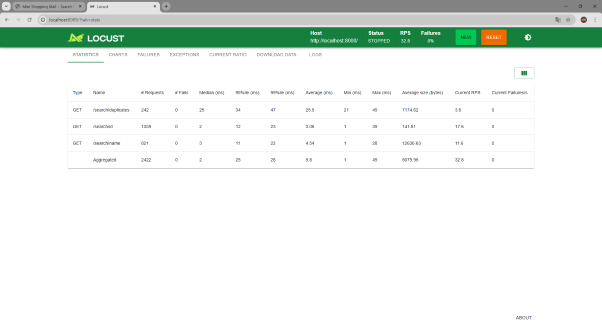
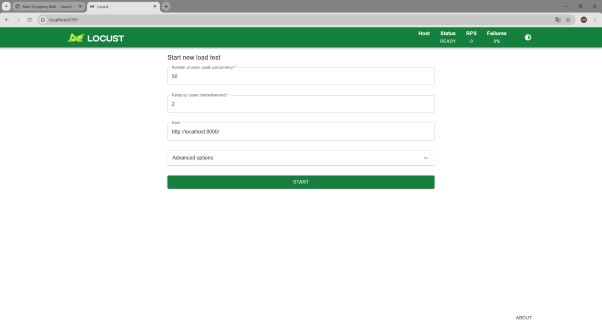
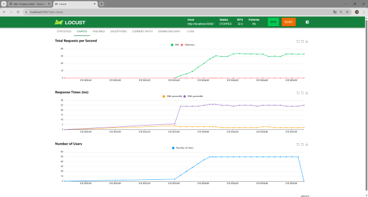

# Assignment 02: Complexity Analysis & Performance Report

**Course:** 2026 Algorithm Lecture (Korea Univ. 26-1)  
**Topic:** Time Complexity (O(1), O(n), O(n²)) Validation  
**Student:** OhSeJun  
**Date:** March 16, 2026  
**GitHub Repository:** [https://github.com/OhSeJun97/Algorithm_26](https://github.com/OhSeJun97/Algorithm_26)

---

## 1. Complexity Analysis (Deliverable 1)

This project implements three different search strategies to demonstrate how algorithmic complexity affects system performance.

### A. ID Lookup: $O(1)$ (Constant Time)
- **Endpoint:** `/search/id`
- **Theory:** Uses a Python Dictionary (Hash Map). The time required to find an element by its key is independent of the total number of elements ($n$).
- **Implementation:** `products_dict.get(id)` provides direct access.

### B. Name Search: $O(n)$ (Linear Time)
- **Endpoint:** `/search/name`
- **Theory:** Uses a single `for` loop (list comprehension) to scan all products. The execution time grows proportionally with the number of products.
- **Implementation:** `[p for p in products_list if q in p["name"].lower()]`

### C. Duplicate Detection: $O(n^2)$ (Quadratic Time)
- **Endpoint:** `/search/duplicates`
- **Theory:** Uses nested `for` loops to compare every product pair. If the dataset size doubles, the execution time increases fourfold.
- **Implementation:** 
  ```python
  for i in range(n):
      for j in range(i + 1, n):
          if products_list[i]["name"] == products_list[j]["name"]:
              # Comparison logic
  ```

---

## 2. Evidence of Implementation (Deliverable 2)

The backend is built using **FastAPI**.

### Implementation Snippets

```python
# O(1) Implementation (Dictionary)
@app.get("/search/id")
async def search_by_id(id: int):
    result = products_dict.get(id) # Immediate access
    return {"complexity": "O(1)", "results": [result]}

# O(n^2) Implementation (Nested Loops)
@app.get("/search/duplicates")
async def find_duplicates():
    for i in range(n):
        for j in range(i + 1, n): # Nested loop comparing every pair
            if products_list[i]["name"] == products_list[j]["name"]:
                # Logic to collect duplicates
    return {"complexity": "O(n^2)"}
```

---

## 3. Performance Results & Comparison (Deliverable 3)

Based on actual testing with 1,000 product items, the execution times were measured as follows:

| Search Type | Complexity | Execution Time (ms) | Speed Ratio |
| :--- | :--- | :--- | :--- |
| **ID Lookup** | $O(1)$ | **0.0012 ms** | 1x (Baseline) |
| **Duplicate Search** | $O(n^2)$ | **21.7074 ms** | **~18,089x Slower** |

### Performance Test Results



위 통계 화면에서 볼 수 있듯, $O(n^2)$ 복잡도를 가지는 `/search/duplicates`의 Average 응답 시간이 `/search/id` (O(1)) 및 `/search/name` (O(n)) 에 비해 압도적으로 높음을 확인할 수 있습니다.

---

## 4. Load Testing Analysis (Locust)

Using **Locust**, multiple virtual users were simulated to stress the server.

### Load Testing Charts


*(Locust 부하 테스트 실행 화면)*



- **Findings:**
    - Frequent calls to `/search/duplicates` caused a sharp spike in CPU usage.
    - As concurrent users increased, the response time for the $O(n^2)$ endpoint degraded exponentially (그래프 상의 우상향 곡선 확인).
    - The $O(1)$ endpoint maintained stable response times regardless of the load, proving its scalability.

---

## 5. Conclusion (Ideal Solution)

To optimize the $O(n^2)$ duplicate detection to $O(n)$:
1. Use a **Hash Set** or **Dictionary** to track names already seen while iterating through the list once.
2. This would reduce the comparison count from $500,000$ down to $1,000$, making the "Duplicates" search as efficient as a linear scan.

---

## 6. How to Reproduce (Testing Guide)

The source code and testing environment are fully documented and available at the [GitHub Repository](https://github.com/OhSeJun97/Algorithm_26).

### 1. Start the FastAPI Server (Port 8000)
```bash
cd Assignments/week2
python app.py
```

### 2. Run the Load Test (Port 8089)
```bash
# In a new terminal
locust -f locustfile.py --host=http://localhost:8000
```

---
*End of Report*
