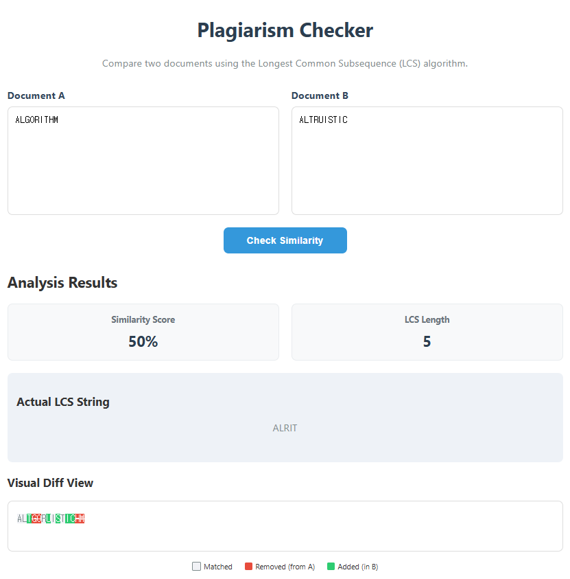

## 1. Algorithm Implementation
### 1.1 Longest Common Subsequence (LCS)
- **Strategy:** 두 문자열 **A**와 **B**에 대해 2차원 DP 테이블을 생성하여 공통 부분 수열의 최대 길이를 계산합니다.
- **Similarity Score = (LCS length / max(len(A), len(B))) x 100%**
- **Diff View:** 백트래킹(Backtracking)을 통해 매칭된 부분(Matched), 삭제된 부분(Removed), 추가된 부분(Added)을 구분하여 시각화합니다.

---

## 2. Results
### 2.1 Application Screenshot

### 2.2 DP Table Trace (Example: "ALGORITHM" vs "ALTRUISTIC")
LCS ("ALRIT")의 길이는 **5**입니다.

| | | A | L | T | R | U | I | S | T | I | C |
|:---:|:---:|:---:|:---:|:---:|:---:|:---:|:---:|:---:|:---:|:---:|:---:|
| | 0 | 0 | 0 | 0 | 0 | 0 | 0 | 0 | 0 | 0 | 0 |
| **A** | 0 | 1 | 1 | 1 | 1 | 1 | 1 | 1 | 1 | 1 | 1 |
| **L** | 0 | 1 | 2 | 2 | 2 | 2 | 2 | 2 | 2 | 2 | 2 |
| **G** | 0 | 1 | 2 | 2 | 2 | 2 | 2 | 2 | 2 | 2 | 2 |
| **O** | 0 | 1 | 2 | 2 | 2 | 2 | 2 | 2 | 2 | 2 | 2 |
| **R** | 0 | 1 | 2 | 2 | 3 | 3 | 3 | 3 | 3 | 3 | 3 |
| **I** | 0 | 1 | 2 | 2 | 3 | 3 | 4 | 4 | 4 | 4 | 4 |
| **T** | 0 | 1 | 2 | 3 | 3 | 3 | 4 | 4 | 5 | 5 | 5 |
| **H** | 0 | 1 | 2 | 3 | 3 | 3 | 4 | 4 | 5 | 5 | 5 |
| **M** | 0 | 1 | 2 | 3 | 3 | 3 | 4 | 4 | 5 | 5 | 5 |

---

## 3. Analysis
### 3.1 Time and Space Complexity
- **Time Complexity: O(m x n)** 
  (여기서 m과 n은 각 문서의 길이). DP 테이블의 모든 셀을 한 번씩 계산해야 하므로 두 문자열 길이의 곱에 비례하는 시간이 소요됩니다.
- **Space Complexity: O(m x n)** 
  두 문자열의 관계를 저장하기 위해 m x n 크기의 2차원 배열이 필요합니다. (단, 최적화를 통해 O(min(m, n))까지 줄일 수 있으나 기본 구현에서는 O(m x n)입니다.)

### 3.2 Relationship with tools like `git diff` or Turnitin
- **git diff:** 파일 간의 차이점을 행 단위로 계산할 때 LCS 알고리즘(또는 이를 개선한 Myers 알고리즘)을 사용합니다. 공통된 부분을 제외한 나머지를 추가/삭제로 표시하여 변경 사항을 효율적으로 보여줍니다.
- **Turnitin:** 문서의 일부 단어가 바뀌거나 문장 구조가 조금 변경되어도 원본과의 공통 부분 수열을 찾아낼 수 있기 때문에, 단순 키워드 매칭보다 더 정교한 표절 검사가 가능합니다.

---

## 4. Conclusion
LCS 알고리즘을 통해 텍스트 간의 구조적 유사성을 효율적으로 파악할 수 있음을 확인하였습니다. 단순한 문자열 일치 확인을 넘어, 동적 계획법을 통해 문서의 변형이나 표절 여부를 판단하는 데 있어 강력한 도구임을 이해할 수 있었습니다.
